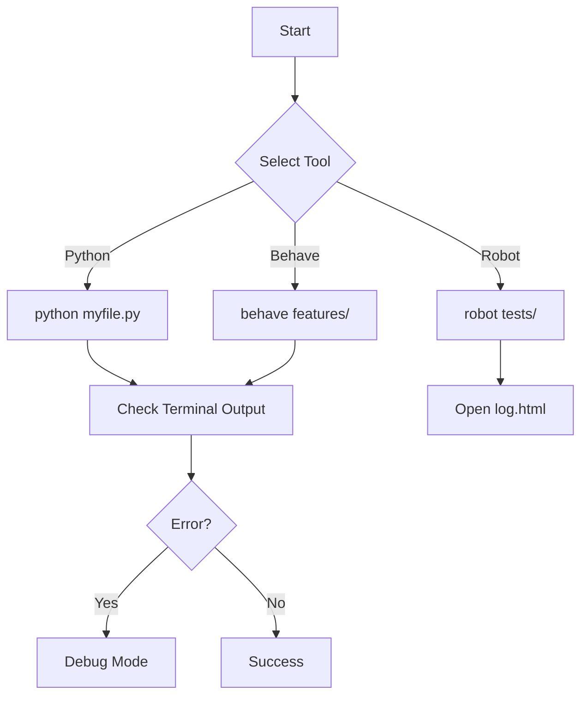

# 🏃 HOW TO RUN & DEBUG: The User Guide
*A complete manual on executing every file in this repository.*

## 1. Execution Flow (Visualized)


## 2. Python Scripts (`.py`)
**Command**: `python <path_to_file>`
*   Example:
    ```bash
    python curriculum/1_python/level_1_beginner.py
    ```

## 3. Robot Framework (`.robot`)
**Command**: `robot <path_to_file>`
*   Example:
    ```bash
    robot curriculum/4_robot_framework/level_1_basics.robot
    ```
*   *Output*: Open `log.html` to see the report.

## 4. Behave / BDD (`.feature`)
**Command**: `behave <path_to_feature>`
*   Example:
    ```bash
    behave portfolio/behave-bdd/features/ui_login.feature
    ```

## 5. SQL Scripts (`.sql`)
1.  **Install**: DBeaver or pgAdmin.
2.  **Run**: Open `.sql` file -> Select Text -> Ctrl+Enter.

---

## 🐞 SECTION 6: HOW TO DEBUG (The "No Google" Guide)

### Strategy A: The "Print" Debugging (Beginner)
If your code crashes, add extensive prints to trace where it stops.
```python
def calculate(x):
    print(f"DEBUG: Entering function with x={x}")  # <--- Add this
    if x == 0:
        print("DEBUG: x is 0, returning 0")        # <--- Add this
        return 0
    return 10 / x
```

### Strategy B: The VS Code Debugger (Pro)
Stop guessing. Watch the code run line-by-line.
1.  **Open** your `.py` file.
2.  **Click** to the left of the line number. A 🔴 **Red Dot** (Breakpoint) appears.
3.  Press **F5** (or Run > Start Debugging).
4.  The code will **PAUSE** at the Red Dot.
5.  **Hover** over variables to see their values.
6.  Use the **Step Over** (Arrow Icon) to move one line at a time.

### Strategy C: Robot Framework Debugging
Robot is harder to debug.
1.  Use `Log To Console    Current value is: ${my_var}`.
2.  Run with **Trace Level**:
    ```bash
    robot --loglevel TRACE tests/my_test.robot
    ```
    *This prints EVERY internal step to the log.html.*
