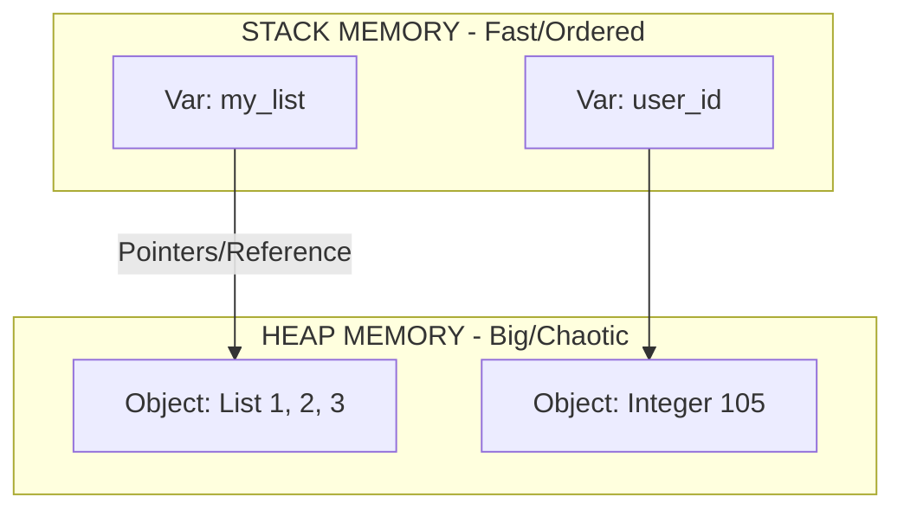

# 🐍 Python Internal Theory: A Deep Dive
*Understanding what happens under the hood.*

## 1. Memory Management (Stack vs Heap) - Visualized
Most beginners rely on Python's auto-magic, but experts know how it works.

### The Stack (Static Memory)
*   **What**: Stores "Method Calls" and "Local References".
*   **Behavior**: LIFO (Last In, First Out).
*   **Example**: When you call `func_a()`, Python pushes it onto the stack. When it finishes, it pops it off. This is very fast.

### The Heap (Dynamic Memory)
*   **What**: Stores the actual **Objects** (Lists, Dictionaries, Class Instances).
*   **Behavior**: Unordered, massive storage.
*   **The Link**: If you say `x = [1, 2, 3]`:
    *   The variable `x` lives in the **Stack**.
    *   It holds a "Pointer" (Memory Address) to the List `[1, 2, 3]` which lives in the **Heap**.

### Garbage Collection (Reference Counting)
How does Python know when to delete an object?
*   Every object has a "Reference Count".
*   `a = [1, 2]` -> List Count = 1 (Used by 'a').
*   `b = a` -> List Count = 2 (Used by 'a' and 'b').
*   `del a` -> List Count = 1.
*   `del b` -> List Count = 0. **DESTROYED**.
*   **Expert Interview Note**: Python also has a "Cyclic Garbage Collector" to find islands of garbage (A points to B, B points to A, but nobody points to them).

---

## 2. Mutable vs Immutable (The Source of Bugs)
*   **Immutable**: Integer, Float, String, Tuple.
    *   *Deep Dive*: If you do `s = "hello"` then `s = s + " world"`, Python destroys "hello" and creates a NEW string "hello world". It never modifies the original memory.
*   **Mutable**: List, Dictionary, Set.
    *   *Deep Dive*: If you pass a list to a function `def add(my_list)`, and the function appends to it, **THE ORIGINAL LIST CHANGES GLOBALLLY**. This is "Pass by Reference".
    *   *Protection*: Use `my_list.copy()` if you don't want side effects.

---

## 3. OOP Principles in Automation

### Encapsulation (Hiding Data)
*   **Concept**: A class should not expose its internal mess.
*   **Automation Example**: Your `LoginPage` class should NOT expose the locator `self.username_locator`. It should only expose the method `login(u, p)`. The test script has no right to know *how* you find the username box, only that you can log in.

### Inheritance (Don't Repeat Yourself)
*   **Concept**: Child classes get functionality from Parents.
*   **Automation Example**:
    *   `BasePage`: Contains common methods like `click()`, `wait_for_element()`, `scroll()`.
    *   `LoginPage(BasePage)`: Inherits all those methods. You don't write `click` code again. You just use it.

### Polymorphism (Many Forms)
*   **Concept**: Different classes having a function with the same name.
*   **Automation Example**:
    *   `ChromeBrowser.launch()`
    *   `FirefoxBrowser.launch()`
    *   Your test loop looks like: `for browser in drivers: browser.launch()`. The test doesn't care which browser it is; it just works.

---

## 4. The GIL (Global Interpreter Lock)
*   **The Myth**: "Python can't do Threads."
*   **The Truth**: Python CAN do threads, but only **One Thread** holds the CPU at a time.
*   **Why**: To prevent memory conflicts (Reference Counting isn't thread-safe).
*   **Impact on You**:
    *   If you are doing **Math/Calculation** (CPU Bound): Threads won't help. Use `Multiprocessing`.
    *   If you are doing **API Requests/Waiting** (I/O Bound): Threads ARE FAST because while one thread waits for the Internet, it releases the lock for another thread to work.
    *   *Verdict*: For Automation (Selenium/API), standard Threading is excellent.
