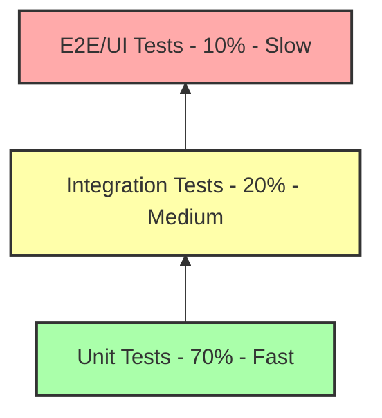
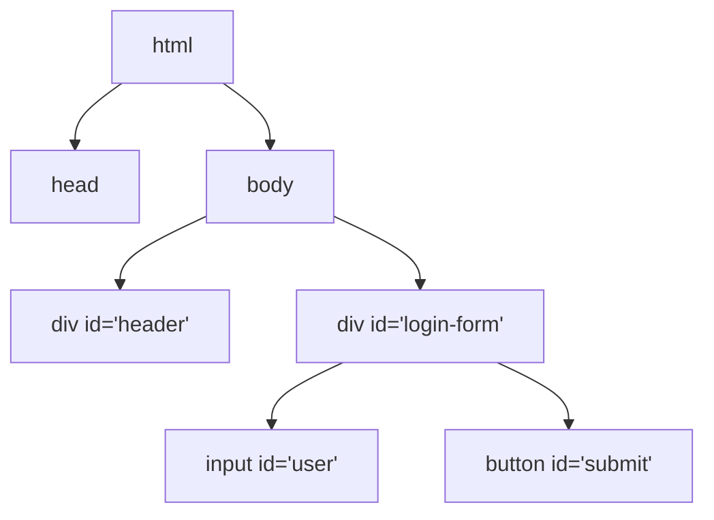

# 🧪 Testing Fundamentals: A Deep Dive Guide
*From "Clicking Around" to "Engineering Quality".*

## 1. The Testing Pyramid (Visualized)
Why do we not just automate everything with Selenium?

### Level 1: Unit Tests (70% of Suite)
*   **What**: Testing the smallest unit of code (a single function).
*   **Analogy**: Checking if a single Lego brick is not broken.
*   **Speed**: Milliseconds.
*   **Deep Dive**: If you write `def calculate_tax(price): return price * 0.1`, a Unit test calls `calculate_tax(100)` and asserts `10`. It does NOT touch the database. It does NOT touch the API. It is pure logic verification.
*   **Why**: If this fails, you know EXACTLY where the bug is (Line 5).

### Level 2: Integration Tests (20% of Suite)
*   **What**: Testing two modules talking to each other (API + DB).
*   **Analogy**: Checking if the Red Lego brick fits onto the Blue Lego brick.
*   **Speed**: Seconds.
*   **Deep Dive**: Does the API endpoint `/login` actually save the user session in the Database? This catches "Contract Issues" (e.g., API sends String, DB expects Integer).

### Level 3: E2E / UI Tests (10% of Suite)
*   **What**: Testing the User Journey from start to finish via the Browser.
*   **Analogy**: Building the whole Lego Castle and shaking the table to see if it falls.
*   **Speed**: Minutes (Slow).
*   **Deep Dive**: We limit these because they are "Flaky". If the internet lags, the test fails. If the button moves 1px, the test MIGHT fail. Use these ONLY for critical flows (Login, Checkout, Payment).

---

## 2. Testing Types: The Dictionary
*   **Smoke Test (Build Verification)**:
    *   *Goal*: Ensuring the application isn't completely broken.
    *   *When*: Runs automatically every time a developer commits code.
    *   *Scope*: 5-10 critical cases (Can I Login? Can I access Dashboard?).
    *   *Failure*: IMMEDIATE STOP. Do not proceed to manual testing.
    
*   **Sanity Test**:
    *   *Goal*: Verifying a specific bug fix or new feature.
    *   *When*: After a deployment to QA environment.
    *   *Scope*: Narrow and deep. If the "Search" feature was fixed, you test "Search" thoroughy. You ignore "Login".

*   **Regression Test**:
    *   *Goal*: Ensuring the "Old Code" still works after "New Code" was added.
    *   *Why*: Developers often introduce "Side Effects". Changing the 'User Profile' code might break the 'Registration' page because they share a database table.
    *   *Automation*: This is the #1 Candidate for Automation.

---

## 3. UI Automation Concepts (The Science)

### The DOM (Document Object Model) - Visualized

Automation is simply traversing this tree to find the `INPUT` leaf.

### Locators: The Art of Finding Elements
1.  **ID (`id='submit'`)**: 
    *   **Verdict**: ⭐⭐⭐⭐⭐ (Best).
    *   *Why*: IDs are supposed to be unique per page. It is fastest for the browser to find.
2.  **CSS Selector (`input[type='text']`)**: 
    *   **Verdict**: ⭐⭐⭐⭐ (Great).
    *   *Why*: Faster than XPath. Clean syntax.
3.  **XPath (`//div[@class='btn']/span`)**: 
    *   **Verdict**: ⭐⭐ (Use sparingly).
    *   *Why*: Slow. It parses the whole tree XML.
    *   *Absolute XPath*: `/html/body/div/div/input` (NEVER USE THIS. If a developer adds one `
` at the top, your test breaks).
    *   *Relative XPath*: `//input[@id='user']` (Better).

---

## 4. The Waiting Game (Synchronization)
The #1 reason automation fails is Timing. The script is faster than the browser.

### The BAD Way: Hard Wait (`time.sleep(5)`)
*   *Code*: "Sleep for 5 seconds."
*   *Scenario A*: Page loads in 1 second. Script waits 5 seconds. **(4 Seconds Wasted)**.
*   *Scenario B*: Page loads in 6 seconds. Script waits 5 seconds. **(Test Fails)**.

### The OK Way: Implicit Wait
*   *Code*: "If you can't find an element, retry for 10 seconds."
*   *Issue*: It applies to EVERYTHING. You can't control specific conditions.

### The BEST Way: Explicit Wait (Smart Wait)
*   *Code*: "Wait UP TO 10 seconds for the 'Login Button' to be **Clickable**."
*   *Scenario A*: Buttons becomes clickable in 2 seconds. Script proceeds immediately. **(0 Waste)**.
*   *Why logic matters*: Sometimes an element is "Present" (in HTML) but not "Visible" (CSS hidden). Explicit wait handles this distinction.
